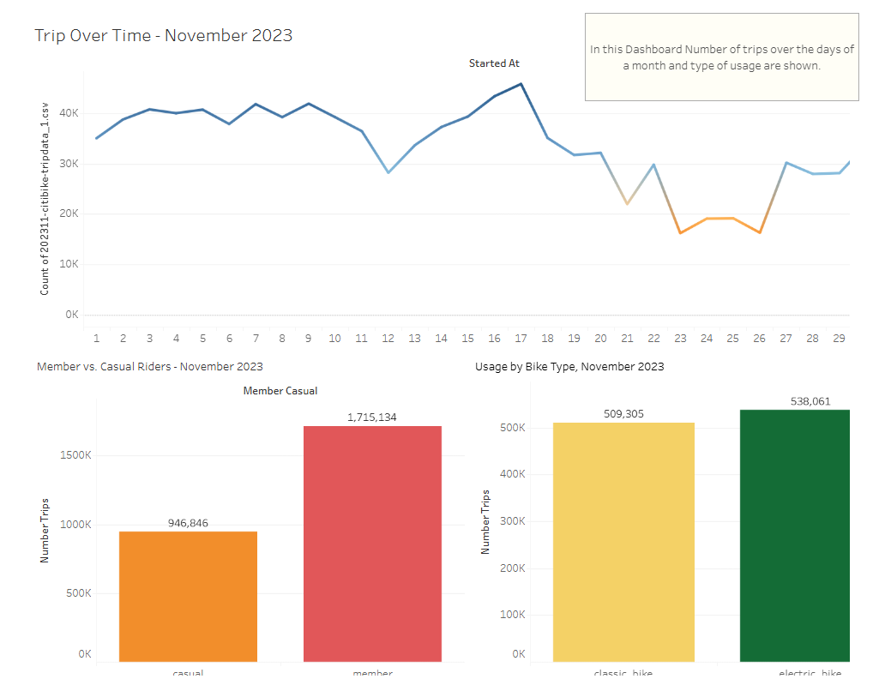
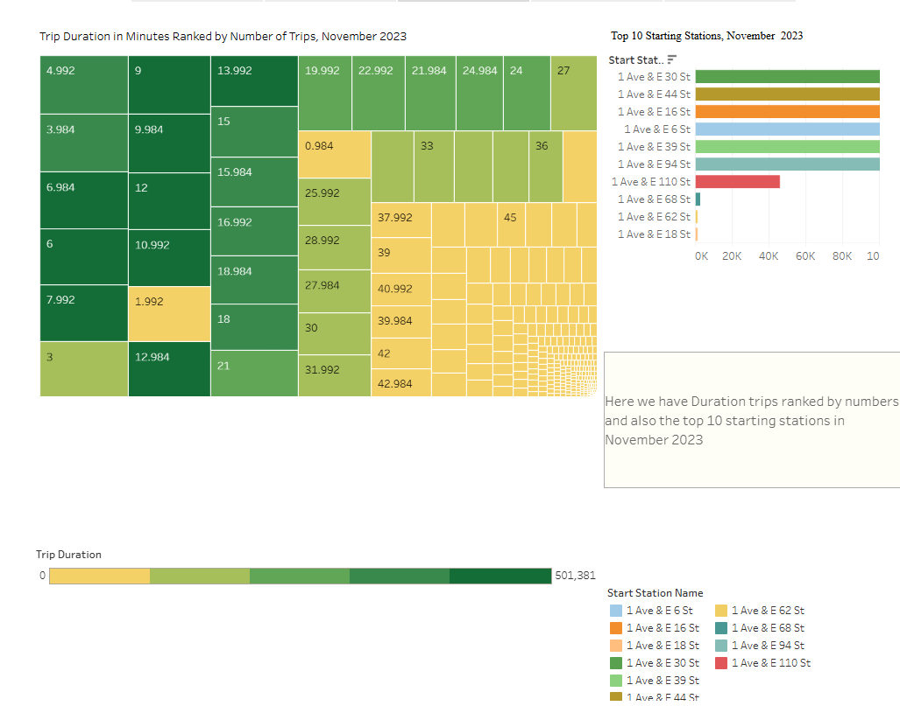
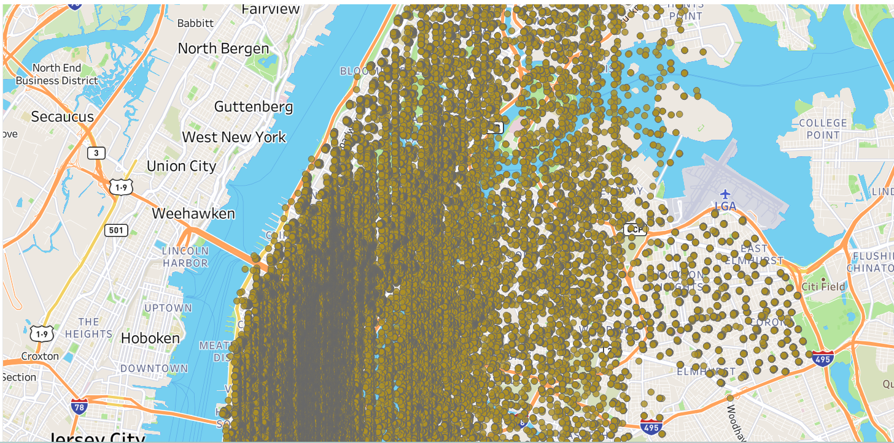

# UofT - Data Analysis Boot Camp

# Module 18 Challenge - Tableau

This Tableau challenge uses Citi Bike trip data to uncover and visualize patterns, trends, and insights into the usage of bike-usage services in New York City during November 2023.

[Module 18 Challenge - Tableau](https://public.tableau.com/app/profile/anwer.dolemeri/viz/NewYorkCitibike_17309157194360/Story1?publish=yes)

Their workbook includes:

1 map

5 visualizations

3 dashboards

1 story

**Daily Trips**

**Starting station & Trip Duration**

**Map of Popular Bike Stations**

**Conclusion**

The data we used is related to November 2023. The second month of winter and the weather situation may be affected on the city trips by bike. By the way trips at the beginning of the month are around 35k and with some fluctuations at the end of the month dropped strongly. The number of Bike usage of members is around twice of casual users. The number of Electric bikes and classic users approximately is the same, with around 500k, using Electric bikes is more. Trip Duration in Minutes Ranked by Number of Trips which is shown in the graph. The top 10 Starting Stations of this month are shown in the presentation. at the End, popular stations at the starting points are shown in a map graph which is an interesting presentation of citibike trips in New York City.
